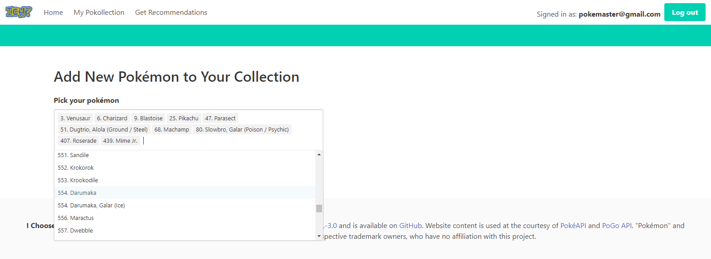
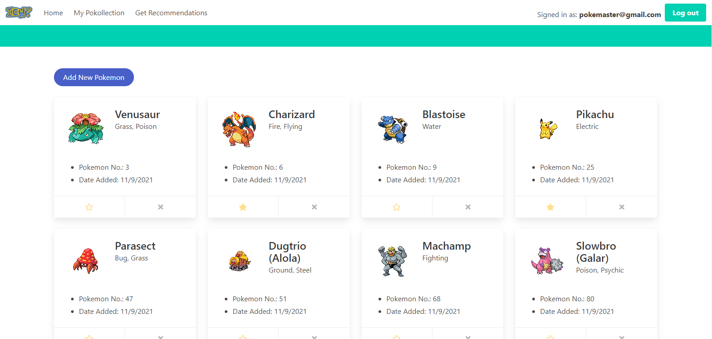
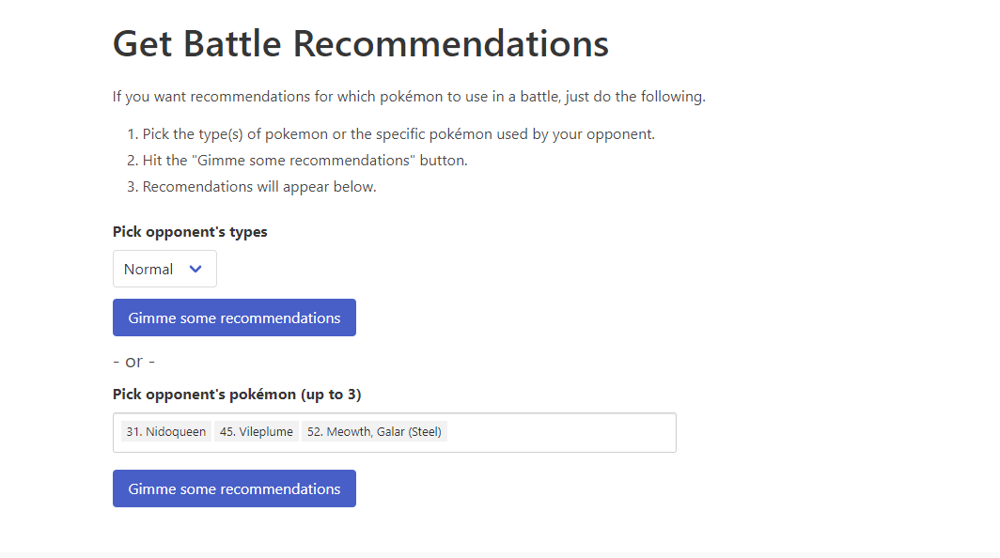
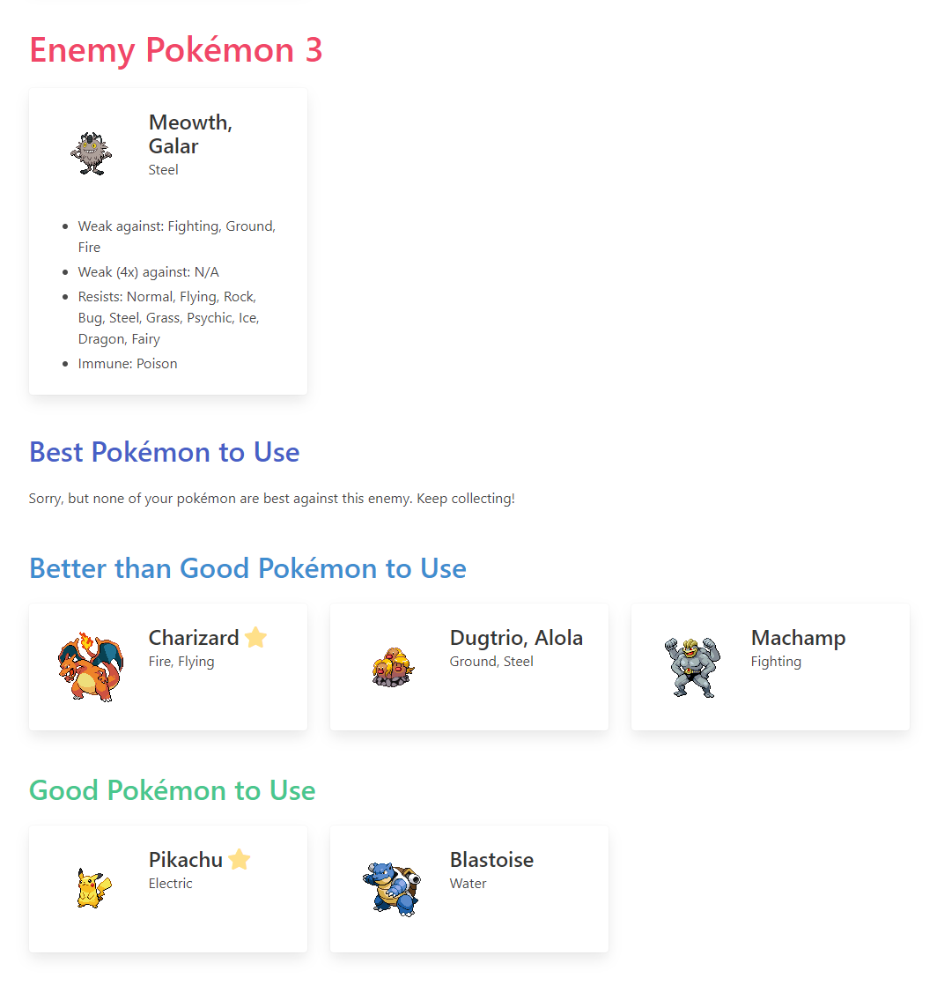

# I-Choose-Who )

## Description

An app that helps users create pokemon teams for pokemon Go based on their collection and opposing pokemon. After creating an account or signing in to an existing account, users can edit their Pokemon collection by adding, removing or marking as favorite on the Pokollection page. On the Recommendations page users can recieve helpful suggestions against a single type of Pokemon or a specific Pokemon, up to three. The suggested Pokemon are split into three categories in order of effectiveness: Best, Better than Good, and Good.

Link to the app on Heroku: [I Choose Who](https://blooming-basin-23447.herokuapp.com/)

## Contents

- [Usage](#usage)
- [Questions](#questions)
- [License](#license)

## Usage

After creating a new account or signing in to an existing one, users can add any number of Pokemon to their collection at once.

Hitting the submit button will add all the selected Pokemon to the user's collection, and display them on the Pokollection page.

On the Get Recommendations page, select a single type of Pokemon or up to three specific Pokemon to fight against and recieve advice about which Pokemon in your collection to use.

The Pokemon suggested to use are ordered by efficacy: Best, Better than Good, and Good.

## Questions

If you have any questions, feel free to reach out via one of the following:

- Github: [@baker-ling](https://github.com/baker-ling/)
- Github: [@mdbow22](https://github.com/mdbow22/)
- Github: [@GRiveroll86](https://github.com/GRiveroll86/)

## License

This application is distributed under the terms of [AGPL License](./LICENSE).